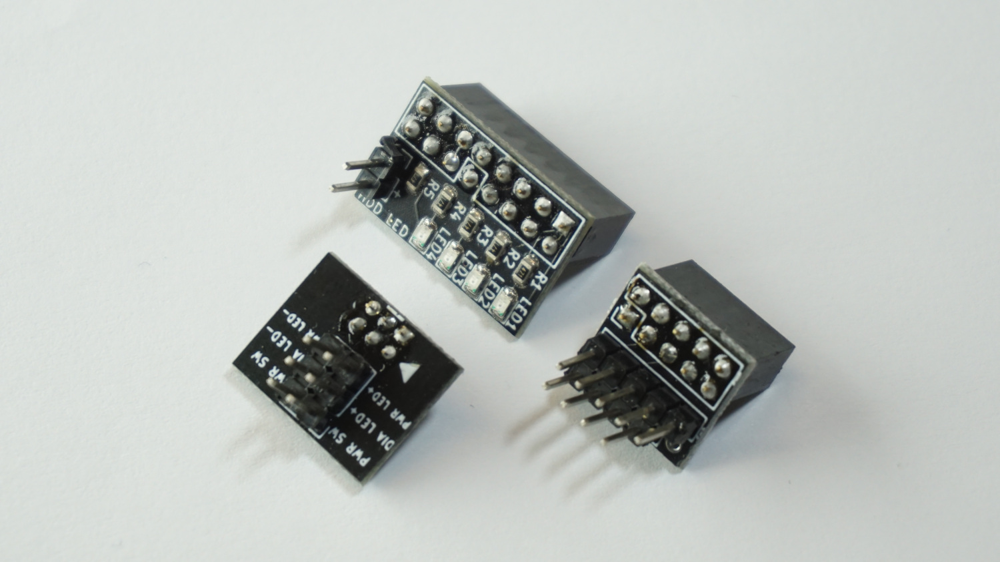
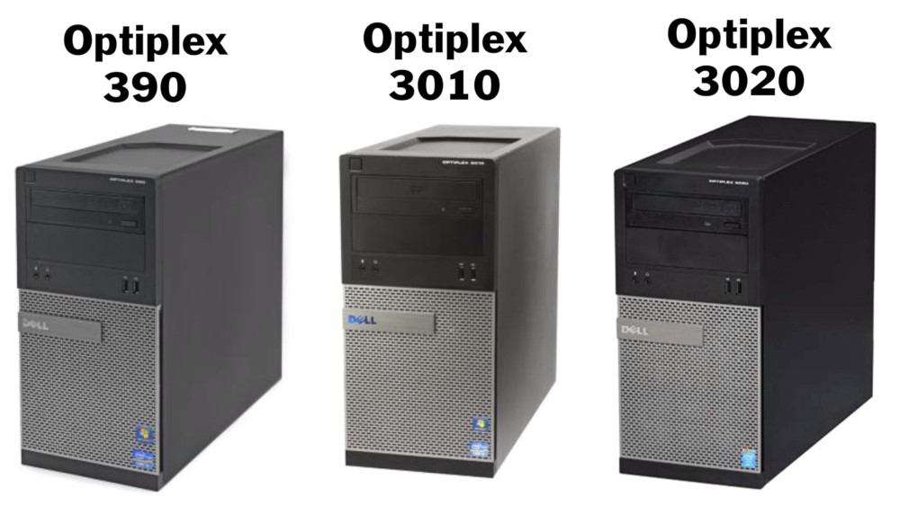
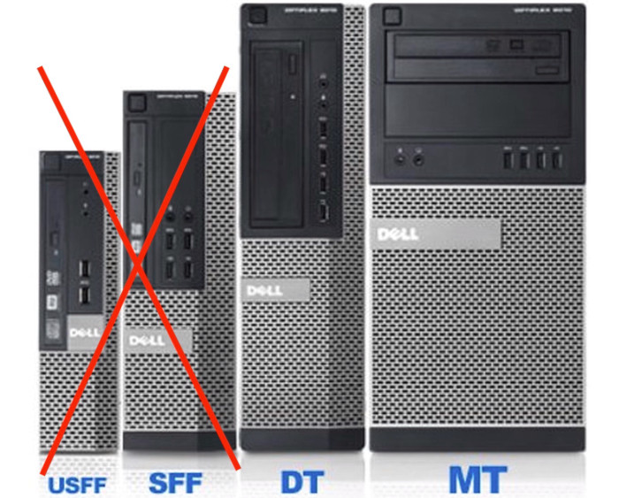

# Front Panel Header Adapters for Dell Optiplex Motherboards

Get it at our store:

https://store.harbinrepairs.com/index.php/product/dell-optiplex-390-3010-3020-front-panel-header-adapter-3pc-kit/

https://store.harbinrepairs.com/index.php/product/dell-5-6-pin-power-button-led-panel-adapter/

Get it on eBay:

https://www.ebay.com/itm/264638815586

https://www.ebay.com/itm/264638806788

## License
Harbin Repairs 2020
Creative Commons Attribution ShareAlike 4.0
https://creativecommons.org/licenses/by-sa/4.0/

GNU General Public License v3.0

Harbin Repairs is not affiliated with Dell in any way shape or form.

## Documentation

This kit is designed for the mid tower (not SFF or small form factor) desktops. It allows you to connect standard PC case front panel headers to the Dell Optiplex 390, 3010, and 3020 motherboards. These are often used to build budget gaming PC’s using decommissioned office desktops and convert them to work with modern PC cases. WARNING! Connecting these adapters in the wrong orientation or on with the wrong models could result in damage to your motherboard. Do not use these adapters with models other than the ones mentioned above and make sure to check out our assembly video below.

### Installation Guide Video

https://www.youtube.com/watch?v=3fb6-B5Ux_s

### Compatibility

The three piece adapter kit is only compatibile with the Dell optiplex 390, 3010, and 3020 DT & MT Dekstops. It will not work on the SFF desktops since they use a different connector and are not ideal since they do not have a removable I/O shield. The 5/6 pin power button however may work with most dell desktops that have a 5/6 pin header for the front panel power button/LED.

### Bill of Materials

| Qty | Description                                    | Aliexpress             | eBay Links (Affiliate)  | Amazon Links (Affiliate) |
|-----|------------------------------------------------|------------------------|-------------------------|--------------------------|
| 3   | PCB                                            | Manufacturer of choice |                         |                          |
| 1   | 2x3 2mm 6pin Female Straight THT Connector     | http://bit.ly/2SQY12E  | https://ebay.to/2P2j5lk | N/A                      |
| 1   | 2x5 2.54mm 10pin Female Straight THT Connector | http://bit.ly/3bOo6ru  | https://ebay.to/2ubbdXK | https://amzn.to/2u3uMky  |
| 1   | 2x8 2.54mm 16pin Female Straight THT Connector | http://bit.ly/39JsCpE  | https://ebay.to/2SA2zeA | https://amzn.to/2Hwy3Mr  |
| 1   | 1x40 2.54mm Male Pin Header THT                | http://bit.ly/2HzO3NS  | https://ebay.to/2V6OmYa | https://amzn.to/38CYH2a  |
| 4   | 0805 SMD Yellow LED                            | http://bit.ly/38DWLGB  | https://ebay.to/2UW0tHL | https://amzn.to/38CjiUj  |
| 5   | 0805 SMD 470Ω Resistor                         | http://bit.ly/2SOXqOO  | https://ebay.to/38CF7D5 | https://amzn.to/38E2ThY  |
